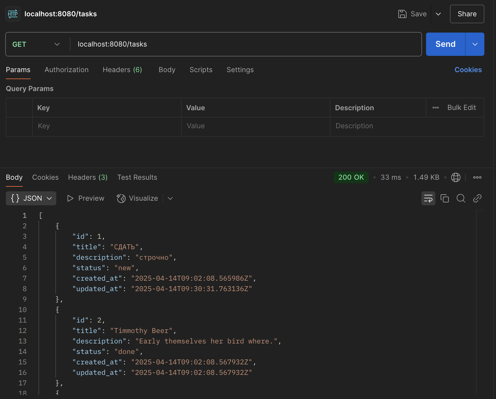
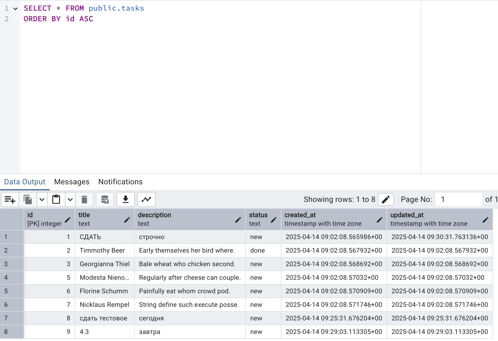

# toDoList
Сервер, реализующий REST API для to-do list.

## API Endpoints
✅ POST /tasks – создание задачи.

✅ GET /tasks – получение списка всех задач.

✅ PUT /tasks/:id – обновление задачи.

✅ DELETE /tasks/:id – удаление задачи.

## Запуск сервера

Убедитесь, что на вашей системе установлен и запущен Docker.

Запустите приложение командой `docker compose up`

Сервер запустится на порту 8080.

## Документация

Swagger UI доступен по пути http://localhost:8080/swagger/index.html

## Скриншоты

### Успешный запрос на http://localhost:8080/tasks

  

### PGAdmin

  

